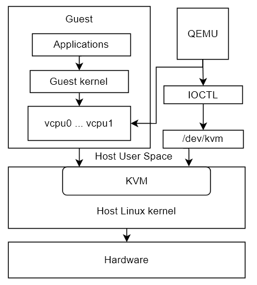

# openEuler WayCa 鲲鹏虚拟化模块介绍

## 一、虚拟化介绍
虚拟化是一种资源管理技术，它将计算机的各种实体资源（CPU、内存、存储、网络等）予以抽象和转化出来，并提供分割、重新组合，以达到最大化利用物理资源的目的。
虚拟化主要分为：CPU虚拟化、内存虚拟化、中断虚拟化、IO设备的虚拟化等。其中qemu-kvm虚拟化技术较为热门。KVM运行在内核空间，负责模拟虚拟机的CPU运行，内存管理，设备管理等；QEMU运行在用户空间，负责模拟虚拟机的IO设备接口以及用户态控制接口。QEMU通过设备文件/dev/kvm进行IOCTL控制KVM模块的运行过程。


## 二、虚拟化特性介绍
### 特性1：支持TRAP DELAY
- 特性介绍

TWE Delay是ARMv8.6扩展中一个可选特性，合入代码到内核中，进入系统后，
dmesg | grep "Delayed Trapping of WFE"有如下打印：
```
CPU features: detected: Delayed Trapping of WFE
```

- 内核配置

CONFIG_ARM64_TWED
- 涉及代码及使能

上游社区：https://gitee.com/openeuler/kernel/tree/OLK-5.10/

| Commit ID  | Subject  | openeuler OLK-5.10 enabled(Y/N)| Linux Mainline enabled(Y/N)  |
| ------------ | ------------ | :------------: |------------|
|  1d9393307f4f |  arm64: cpufeature: TWED support detection |  Y | N  |
| 9c8b91e8dbf7  | KVM: arm64: Make use of TWED feature  |  Y | N  |

### 特性2：支持ARM pvspinlock
- 特性介绍

对于Guest OS上每个CPU（称为VCPU）实际上为Host OS上一个线程，该线程可称为VCPU线程。当虚拟机上VCPU大于实际CPU数目时，很多VCPU线程可能处于被调出SCHED_OUT的状态。在调度和锁的某些场景下，这些VCPU线程虽然处于SCHED_OUT状态，无法工作，但在Guest OS中呈现出这些VCPU处于idle，因此在Guest OS中仍尝试将任务往这些VCPU上执行，从而造成任务的阻塞或时延增大。
在当前内核的调度和锁的某些场景下允许Guest OS通过vcpu_is_preempted()检查VCPU是否被SCHED_OUT，从而决定在Guest OS中是否将任务在这些VCPU上执行，达到优化性能的目的。

- 特性使能

使能配置项：

CONFIG_PARAVIRT

CONFIG_PARAVIRT_SPINLOCKS
- 特性测试

```
unix benchmark result:
  host:  kernel 4.19.87, HiSilicon Kunpeng920, 8 CPUs
  guest: kernel 4.19.87, 16 vCPUs

               test-case                |    after-patch    |   before-patch
----------------------------------------+-------------------+------------------
 Dhrystone 2 using register variables   | 338955728.5 lps   | 339266319.5 lps
 Double-Precision Whetstone             |     30634.9 MWIPS |     30884.4 MWIPS
 Execl Throughput                       |      6753.2 lps   |      3580.1 lps
 File Copy 1024 bufsize 2000 maxblocks  |    490048.0 KBps  |    313282.3 KBps
 File Copy 256 bufsize 500 maxblocks    |    129662.5 KBps  |     83550.7 KBps
 File Copy 4096 bufsize 8000 maxblocks  |   1552551.5 KBps  |    814327.0 KBps
 Pipe Throughput                        |   8976422.5 lps   |   9048628.4 lps
 Pipe-based Context Switching           |    258641.7 lps   |    252925.9 lps
 Process Creation                       |      5312.2 lps   |      4507.9 lps
 Shell Scripts (1 concurrent)           |      8704.2 lpm   |      6720.9 lpm
 Shell Scripts (8 concurrent)           |      1708.8 lpm   |       607.2 lpm
 System Call Overhead                   |   3714444.7 lps   |   3746386.8 lps
----------------------------------------+-------------------+------------------
 System Benchmarks Index Score          |      2270.6       |      1679.2
```
- 涉及代码及使能

上游代码分支：https://gitee.com/openeuler/kernel/tree/OLK-5.10

| Commit ID | Subject |  openEuler OLK-5.10 enabled(Y/N)| Linux Mainline enabled（Y/N）
| ------------ | ------------ | :----------:| :-----------: |
| b74edaf629bd  | KVM: arm64: Document PV-sched interface  | Y |  N|
| a0b95bdf6a0b  | KVM: arm64: Implement PV_SCHED_FEATURES call  |  Y| N |
| 76732c97a3ec  | KVM: arm64: Support pvsched preempted via shared structure  | Y|  N|
| 63042c58affc  | KVM: arm64: Add interface to support vCPU preempted check  |  Y|  N|
| cf6d95e33dfa  | KVM: arm64: Support the vCPU preemption check  |  Y|  N|
| 7a645f6e24ee  | KVM: arm64: Add SMCCC PV-sched to kick cpu  |  Y|  N|
| efed88dd5934  | KVM: arm64: Implement PV_SCHED_KICK_CPU call  | Y | N |
| 12e1ed766c34  | KVM: arm64: Add interface to support PV qspinlock  | Y | N |
| 72fa593a0e5f  | KVM: arm64: Enable PV qspinlock  |  Y| N|
| fab413f6ee84  | KVM: arm64: Add tracepoints for PV qspinlock  | Y | N |
| 38134bb6f2a4  | arm/arm64: paravirt: Remove GPL from pv_ops export  | Y | N |
| bf96cce4df94  | kvm: arm64: fix some pvsched bugs  |  Y|N |

### 特性3：支持VFIO直通热迁移
- 特性介绍

VFIO直通热迁移功能主要包含两方面内容：DMA脏页热迁移和中断状态热迁移。

鲲鹏920设计实现SMMU HTTU硬件辅助虚拟化扩展，支持硬件自动标记脏页，将设备DMA脏页信息记录在页表项，为DMA脏页迁移提供了硬件支持。基于此硬件特性，在SMMU驱动层实现DMA自动标脏的机制，其中包括一套完整的页表操作、时序控制；同时在内核定义一套完整的脏页管理接口规范，包括开启/关闭标脏、取脏、清脏等用户态接口，实现设备DMA脏页热迁移。

VFIO直通热迁移场景，采用GICv4.1中断透传场景，虚拟中断状态维护在VPT表中，需要软硬结合维护虚拟中断信息。鲲鹏920设计实现GICv4.1硬件辅助虚拟化扩展，通过软件方式同步GIC硬件cache。软件通过访问内存中的虚拟pending表，实现中断状态的保存&恢复。
- 接口描述

DMA脏页热迁移功能接口表

| 接口名称  | 涉及子系统/模块  | 描述  |
| ------------ | ------------ | ------------ |
|vfio_iova_dirty_log_clear   | VFIO/type1  | 接收并处理QEMU下发的清脏请求  |
|  iommu_switch_dirty_log | IOMMU/SMMU  |  开启/关闭标脏 |
| iommu_sync_dirty_log  | IOMMU/SMMU  | 获取DMA内存脏页信息  |
| iommu_clear_dirty_log  | IOMMU/SMMU  | 清空DMA内存脏页bitmap，并将页表写保护  |

中断状态热迁移功能接口表

| 接口名称  | 涉及的子系统/模块  |描述   |
| ------------ | ------------ | ------------ |
| vgic_v4_get_vlpi_state  | KVM  | 根据规范从硬件获取中断状态  |
- 涉及代码及使能

DMA脏页热迁移：

内核部分上游社区：https://gitee.com/openeuler/kernel/tree/OLK-5.10/

| Commit ID  | Subject  | openEuler OLK-5.10 enabled(Y/N)  | Linux Mainline enabled(Y/N) |
| ------------ | ------------ | :------------: | :------------: |
| b5ea330577ac  | vfio/iommu_type1: Mantain a counter for non_pinned_groups  | Y  |  N |
| bbf3b39e5576  | iommu: Introduce dirty log tracking framework  |  Y | N  |
| 341497bb2613  | iommu/io-pgtable-arm: Add quirk ARM_HD and ARM_BBMLx  | Y  | N  |
| 8b8bda8ea12f  |iommu/io-pgtable-arm: Add and realize split_block ops   | Y  |  N |
| bca6b146b15b  | iommu/io-pgtable-arm: Add and realize merge_page ops  |  Y | N  |
| f92820e88ef3  | iommu/io-pgtable-arm: Add and realize sync_dirty_log ops  | Y  |   N|
| bdc8c00c1eef  | iommu/io-pgtable-arm: Add and realize clear_dirty_log ops  | Y  |  N |
| 240923005330  | iommu/arm-smmu-v3: Add support for Hardware Translation Table Update  | Y  | N  |
| c2f77dfa27a1  | iommu/arm-smmu-v3: Enable HTTU for stage1 with io-pgtable mapping  | Y  |  N |
| 829e1611a732  |  iommu/arm-smmu-v3: Add feature detection for BBML |  Y |  N |
| 947019a923b9  | iommu/arm-smmu-v3: Realize switch_dirty_log iommu ops  | Y  |  N |
| beee685e5432  | iommu/arm-smmu-v3: Realize sync_dirty_log iommu ops  |  Y | N  |
| 5e064fc06d95  | iommu/arm-smmu-v3: Realize clear_dirty_log iommu ops| Y| N|
| 74f676cb92db| iommu/arm-smmu-v3: Realize support_dirty_log iommu ops |Y |N|
| d2373c56459f| vfio/iommu_type1: Add HWDBM status maintenance | Y|N|
| 1421b71ccda9|vfio/iommu_type1: Optimize dirty bitmap population based on iommu HWDBM |Y |N|
| f1c9b9fa4fbc|vfio/iommu_type1: Add support for manual dirty log clear |Y|N|

qemu部分上游社区:https://gitee.com/openeuler/qemu/tree/qemu-6.2.0

| Commit ID  | Subject  | openEuler/qemu/qemu-6.2.0 enabled(Y/N)  | qemu mainline enabled(Y/N)  |
| ------------ | ------------ | :------------: | :------------: |
|  4051277362 | linux-headers: update against 5.10 and manual clear vfio dirty log series  | Y  | N  |
| ac1bf3edcd  | vfio: Maintain DMA mapping range for the container  | Y  |  N |
|  815258f81a | vfio/migration: Add support for manual clear vfio dirty log  |  Y | N  |

中断状态热迁移：

上游社区仓库：https://git.kernel.org/pub/scm/linux/kernel/git/torvalds/linux.git

|  Commit ID | Subject  | openEuler OLK-5.10 enabled(Y/N)  | Linux Mainline enabled(Y/N)  |
| ------------ | ------------ | :------------: | :------------: |
| 301beaf19739  |irqchip/gic-v3-its: Add a cache invalidation right after vPE unmapping   | Y  | Y  |
| c21bc068cdbe  |irqchip/gic-v3-its: Drop the setting of PTZ altogether   |  Y |   Y|
| 80317fe4a653  | KVM: arm64: GICv4.1: Add function to get VLPI state  |  Y | Y  |
| f66b7b151e00  | KVM: arm64: GICv4.1: Try to save VLPI state in save_pending_tables  |  Y |   Y|
| 12df7429213a  | KVM: arm64: GICv4.1: Restore VLPI pending state to physical side  |  Y |  Y |
| 8082d50f4817  | KVM: arm64: GICv4.1: Give a chance to save VLPI state  |  Y |   Y|

### 特性4：支持虚拟内存/存储
- 特性介绍

该特性主要是qemu支持nvdimm/pmem以及内存的热插操作，nvdimm用作虚拟机磁盘，pc-dimm用作虚拟机内存。
- nvdimm支持

虚拟机启动命令
```c
qemu-system-aarch64 -machine virt,kernel_irqchip=on,gic-version=3,nvdimm=on \
-m 1G,maxmem=5G,slots=4 \
-object memory-backend-ram,id=ram1,size=1G \
-device nvdimm,id=dimm1,memdev=ram1 \
-enable-kvm -cpu host \
-smp 2 \
-bios ./QEMU_EFI.fd \
-kernel ./Image -initrd ./minifs.cpio.gz -nographic \
-append "rdinit=init console=ttyAMA0 earlycon=pl011,0x90000000" -net none
```
进入虚拟机后，使用命令 fdisk -l 查看配置的nvdimm大小，按Ctrl + A后松开迅速按C进入（退出）qemu monitor中,输入以下命令查询配置的nvdimm相关信息
```c
info memory_size_summary
info memory-devices
```

- pc-dimm支持

虚拟机启动命令中添加
```c
qemu-system-aarch64 -machine virt,gic-version=3 \
-m 4G,maxmem=8G,slots=4 \
-object memory-backend-ram,id=ram1,size=1G \
-device pc-dimm,id=dimm1,memdev=ram1 \
-enable-kvm -cpu host -smp 4 \
...
```
进入虚拟机后，使用 free 命令查看内存大小为配置的pc-dimm大小加上基础内存大小，按Ctrl + A后松开迅速按C进入（退出）qemu monitor中,输入以下命令查询配置的pc-dimm相关信息

```c
info memory_size_summary
info memory-devices
```
- 涉及代码及使能

上游社区代码仓：https://github.com/qemu/qemu.git

| Commit ID  | Subject  | openEuler/qemu/qemu-6.2.0 enabled(Y/N)  | qemu mainline enabled(Y/N)  |
| ------------ | ------------ | :------------: | :------------: |
| ce4adc0b6e  |exec: Fix for qemu_ram_resize() callback   | Y  | Y  |
| 71b0269ae9  | hw/acpi/nvdimm: Fix for NVDIMM incorrect DSM output buffer length  | Y  | Y  |
| 5c94b82662  | nvdimm: Use configurable ACPI IO base and size  |  Y | Y  |
| b5a60bee74  | hw/arm/virt: Add nvdimm hot-plug infrastructure  |  Y |  Y |
|  c2505d1c56 | hw/arm/virt: Add nvdimm hotplug support  | Y  | Y  |
|122752d267   | tests: Update ACPI tables list for upcoming arm/virt test changes  |  Y | Y  |
| 62293b4f58  | bios-tables-test: test pc-dimm and nvdimm coldplug for arm/virt  |  Y |  Y |

- nvdimm热插

虚拟机启动命令中加入

```c
qemu-system-aarch64 -machine virt,kernel_irqchip=on,gic-version=3,nvdimm=on \
-m 8G,maxmem=16G,slots=4 \
-enable-kvm -cpu host -smp 8 \
-bios QEMU_EFI.fd \
...
```

进入虚拟机后，按Ctrl + A后松开迅速按C进入qemu monitor中，使用以下命令向虚拟机插入nvdimm：

```c
object_add memory-backend-ram,id=ram1,size=2G
device_add nvdimm,id=dimm1,memdev=ram1
```

显示热插成功后，输入以下命令查询插入的nvdimm相关信息
```c
info memory_size_summary
info memory-devices
```

使用进入qemu monitor的同样方法退出qemu monitor，使用命令 fdisk -l 可以查看插入的nvdimm大小。
- pc-dimm热插

虚拟机启动命令中加入

```c
qemu-system-aarch64 -machine virt,gic-version=3 \
-m 8G,maxmem=16G,slots=4 \
-enable-kvm -cpu host -smp 8 \
-bios QEMU_EFI.fd \
...
```

进入虚拟机后，按Ctrl + A后松开迅速按C进入qemu monitor中，使用以下命令向虚拟机插入pc-dimm：
```c
object_add memory-backend-ram,id=ram1,size=2G
device_add pc-dimm,id=dimm1,memdev=ram1
```

显示热插成功后，输入以下命令查询插入的pc-dimm相关信息
```c
info memory_size_summary
info memory-devices
```
使用进入qemu monitor的同样方法退出qemu monitor，使用命令 free 可以查看插入的pc-dimm大小。
- 涉及代码及使能

上游社区代码仓：https://github.com/qemu/qemu.git

| Commit ID  | Subject  | openEuler/qemu/qemu-6.2.0 enabled(Y/N)  | qemu mainline enabled(Y/N)  |
| ------------ | ------------ | :------------: | :------------: |
| 091c466e26  | hw/acpi: Make ACPI IO address space configurable  | Y  | Y  |
| 22338fea78  |Do not create memory hotplug method when handler is not defined   | Y  | Y  |
| ebb6207502 | hw/acpi: Add ACPI Generic Event Device Support  | Y  | Y  |
| 1f283ae124   | hw/arm/virt: Add memory hotplug framework  | Y  |  Y |
| cff51ac978  | hw/arm/virt: Enable device memory cold/hot plug with ACPI boot  |  Y |  Y |
| 442da7dc77  |hw/arm/virt-acpi-build: Add PC-DIMM in SRAT   |  Y |  Y |
| c345680cb4  | hw/arm: Factor out powerdown notifier from GPIO  |  Y | Y  |
| 1962f31b86  | hw/arm: Use GED for system_powerdown event  |  Y | Y  |
| e86fba5009  | docs/specs: Add ACPI GED documentation  |  Y |  Y |
| cd0f061c78  | tests: Update ACPI tables list for upcoming arm/virt tests  |  Y | Y  |
| 669c77433b  | tests: Add bios tests to arm/virt  |  Y | Y  |

### 特性5：支持TLBI广播优化
- 特性介绍

在虚拟化场景，硬件不感知一个虚拟机vCPU线程具体在哪些pCPU上运行过，因此vCPU的TLBI指令会被统一广播到全系统范围的所有物理核上，并在所有物理核上刷新TLB，这里会产生不必要的性能开销。从功能上分析，硬件只需要在该vCPU运行过的那些pCPU上刷新TLB即可。

DVMBM特性，用于TLBI广播优化。新增寄存器用于检测硬件是否支持该特性、开启/关闭特性、配置TLBI的广播范围等。开启TLBI广播优化特性后，在虚拟化场景，通过配置一个pCPU的LSUDVMBM_EL2寄存器，可以控制该pCPU上的虚拟机TLBI指令只在指定的CPU范围内广播，从而避免不必要的开销。
- DVMBM使能

软件上新增了一个内核启动参数，可以在用户态全局地开启/关闭DVMBM特性，系统默认为关闭。若要使能该特性，可以在Host内核的启动命令中配置该参数值为1，即kvm-arm.dvmbm_enabled =1，在KVM初始化阶段，若系统检测到硬件支持DVMBM特性且参数dvmbm_enabled的值为1时，会将所有的物理核的DVMBM特性开启，并打印kvm [1]: KVM dvmbm enabled 。否则，会将所有的物理核的DVMBM特性关闭，并打印kvm [1]: KVM dvmbm disabled 。

- 内核配置

CONFIG_KVM_HISI_VIRT

- 特性检测及应用

TLBI广播优化特性检测：
<br>
AIDR_EL1寄存器
检测硬件是否支持DVMBM特性，即TLBI范围广播。
读取AIDR_EL1：该寄存器为自定义特性ID寄存器。

|  [31:14] |  [13:12] |  [11] |  [10] | [9] |[8]|[7]|[6]|[5]|[4]|[3-0]|
| ------------ | ------------ | ------------ | ------------ | -------- | --- | -- | -- | -- | -- | -- |
|   | DVMBM  |   |   |

0b00：不支持TLBI广播优化特性；0b01：支持TLBI广播优化特性。

TLBI广播优化特性应用：
<br>
LSUDVMBM_EL2寄存器
增加LSUDVMBM_EL2寄存器，该寄存器用于保存TLBI范围广播的CPU位图。当虚拟机vCPU执行TLBI指令时，其所在的物理CPU会首先读取LSUDVMBM_EL2寄存器中保存的CPU位图，并只将TLBI指令广播至位图中指定的pCPU上，即只在一定范围内的物理CPU上刷新TLB。

目前TLBI的广播范围以VM为粒度，即广播的CPU范围是该虚拟机所有vCPU绑核范围的并集。举例来说，配置4U虚拟机，vCPU 0-3分别一一绑核至物理机的2，4，6，8号CPU上，那么该虚拟机的TLBI广播范围为[2, 4, 6, 8]。当虚拟机的某个vCPU执行TLBI指令时，该vCPU所运行的物理核会将TLBI指令统一广播至2，4，6，8号CPU上执行。
- 涉及代码及使能

上游社区：https://gitee.com/openeuler/kernel/tree/OLK-5.10/

| Commit ID  | Subject  | openeuler OLK-5.10 enabled（Y/N）  | The Mainline of Linux enabled(Y/N)|
| ------------ | ------------ | :------------: | :---: |
|  7b4316e960ed | KVM: arm64: Support a new HiSi CPU type  |  Y |N|
| 31e5359825aa  |   KVM: arm64: Probe and configure DVMBM capability on HiSi CPUs | Y  |N |
| 8d396309b829  |  KVM: arm64: Add kvm_vcpu_arch::cpus_ptr and pre_cpus_ptr |  Y |N |
| f0a92b35997a  |  KVM: arm64: Add kvm_arch::dvm_cpumask and dvm_lock  |  Y | N|
| 1489b74dd421  |  KVM: arm64: Implement the capability of DVMBM |   Y| N|
### 特性6：支持SVE2虚拟化
- 特性介绍

SVE/SVE2虚拟化的目标，是要给虚拟机呈现SVE特性，包括SVE指令集以及SVE寄存器组，从而虚拟机能够基于SVE矢量运算提升整机计算性能，如编译性能优化等。
- 内核配置及硬件支持

SVE使能需要开启以下内核配置：CONFIG_ARM64_SVE

硬件支持SVE/SVE2：ID_AA64PFR0_EL1和ID_AA64ZFR0_EL1寄存器

ID_AA64PFR0_EL1寄存器的SVE, bits [35:32]

Scalable Vector Extension. Defined values are:

| SVE  |  Meaning |
| ------------ | ------------ |
| 0b0000  | SVE architectural state and programmers' model are not implemented.  |
| 0b0001 | SVE architectural state and programmers' model are implemented.  |

ID_AA64ZFR0_EL1寄存器的SVEver, bits [3:0]

Indicates support for SVE.Defined values are:

| SVEver  | Meaning  |
| ------------ | ------------ |
| 0b0000  | SVE instructions are implemented.  |
| 0b0001  |  SVE and the non-optional SVE2 instructions are implemented.|

- 接口描述

|  接口名称 | 接口类型  | 涉及的子系统/模块  | 描述  |
| ------------ | ------------ | ------------ | ------------ |
|  “sve” | QEMU命令行参数  |  QEMU | 用户通过该参数，控制是否给vcpu使能FEAT_SVE  |
|  “sve<N>”，如sve128，sve256等|QEMU命令行参数   |  QEMU | 用户通过该参数，指定vcpu上支持的SVE vector length  |

qemu启动命令中-cpu 参数可以设置sve长度：-cpu host,sve128=on或者sve256=on等。
  
查询SVE/SVE2特性支持情况：

用户态软件可以通过<sys/auxv.h>中getauxval(AT_HWCAP)/getauxval(AT_HWCAP2)函数判断当前的硬件和内核是否支持SVE/SVE2；通过lscpu命令或/proc/cpuinfo文件可查看SVE/SVE2虚拟化的支持情况。

可通过/proc/sys/abi/sve_default_vector_length查看SVE的向量长度。

- 涉及代码及使能

上游社区代码仓： https://github.com/qemu/qemu.git

|  Commit ID（qemu主线） | Subject  | openEuler/qemu/qemu-6.2.0 enabled(Y/N)|
| ------------ | ------------ | :------------: |
|  e19afd5667 |  target/arm/monitor: Introduce qmp_query_cpu_model_expansion | Y  |
|  bd31b751a3 | tests: arm: Introduce cpu feature tests  |  Y |
| 73234775ad  |  target/arm: Allow SVE to be disabled via a CPU property | Y  |
| 0df9142d27  | target/arm/cpu64: max cpu: Introduce sve<N> properties  |  Y |
|  40b3fd21fb | target/arm/kvm64: Add kvm_arch_get/put_sve  |   Y|
|  14e99e0fbb | target/arm/kvm64: max cpu: Enable SVE when available  | Y  |
|  0cdb4020b3 | target/arm/kvm: scratch vcpu: Preserve input kvm_vcpu_init features  | Y  |
| 6fa8a37949  |  target/arm/cpu64: max cpu: Support sve properties with KVM |  Y |
| 87014c6b36 | target/arm/kvm: host cpu: Add support for sve<N> properties|Y | 

上游社区代码仓： https://github.com/qemu/qemu.git

|  Commit ID (qemu主线)  | Subject  | openEuler/qemu/qemu-6.2.0 enabled(Y/N)  |
| ------------ | ------------ | :------------: |
|  0dd14e9555 | target/arm: Use kvm_arm_sve_supported in kvm_arm_get_host_cpu_features  |Y   |
| b9e8d68a39  | target/arm: Set KVM_ARM_VCPU_SVE while probing the host  | Y  |
| 5265d24c98  | target/arm: Move sve probe inside kvm >= 4.15 branch  |  Y |


上游社区代码仓： http://git.kernel.org/pub/scm/linux/kernel/git/torvalds/linux.git

|  Commit ID（linux主线） | Subject  | openeuler OLK-5.10 enabled（Y/N）  |
| ------------ | ------------ | :------------: |
| fd3bc912d3d1  |  KVM: Documentation: Document arm64 core registers in detail | Y  |
| efbc20249fee  | arm64: fpsimd: Always set TIF_FOREIGN_FPSTATE on task state flush  | Y  |
|  38abf22e122e |  KVM: arm64: Delete orphaned declaration for __fpsimd_enabled() |   Y|
|  7aa92cf318f8 | KVM: arm64: Refactor kvm_arm_num_regs() for easier maintenance  |  Y |
|  3f61f40947e8 | KVM: arm64: Add missing #includes to kvm_host.h  |  Y |
|  8b08e8401fb4 | arm64/sve: Clarify role of the VQ map maintenance functions  | Y  |
| d06b76be8dad  |  arm64/sve: Check SVE virtualisability |   Y|
| 0495067420f3  | arm64/sve: Enable SVE state tracking for non-task contexts  |  Y |
|1765edbab16e| KVM: arm64: Add a vcpu flag to control SVE visibility for the guest|Y |
|1c19991390ae| KVM: arm64: Propagate vcpu into read_id_reg()| Y|
|7f34e4090394| KVM: arm64: Support runtime sysreg visibility filtering | Y|
|73433762fcae| KVM: arm64/sve: System register context switch and access support|Y |
|b43b5dd990eb| KVM: arm64/sve: Context switch the SVE registers| Y|
|2b953ea34812| KVM: Allow 2048-bit register access via ioctl interface| Y|
|dc52f31a928b| KVM: arm64: Add missing #include of <linux/string.h> in guest.c| Y|
|be25bbb392fa| KVM: arm64: Factor out core register ID enumeration| Y|
|8c86dfe39d5d| KVM: arm64: Reject ioctl access to FPSIMD V-regs on SVE vcpus|Y |
|e1c9c98345b3| KVM: arm64/sve: Add SVE support to register access ioctl interface|Y |
|8e3c54c8b6a9| KVM: arm64: Enumerate SVE register indices for KVM_GET_REG_LIST| Y|
|ead9e430c0fb| arm64/sve: In-kernel vector length availability query interface| Y|
|0f062bfe36b6| KVM: arm/arm64: Add hook for arch-specific KVM initialisation| Y|
|7dd32a0d0103| KVM: arm/arm64: Add KVM_ARM_VCPU_FINALIZE ioctl| Y|
|9033bba4b535| KVM: arm64/sve: Add pseudo-register for the guest's vector lengths|Y |
|9a3cdf26e336| KVM: arm64/sve: Allow userspace to enable SVE for vcpus| Y|
|555f3d03e7fb| KVM: arm64: Add a capability to advertise SVE support|Y |
|395f562f2b4c| KVM: Document errors for KVM_GET_ONE_REG and KVM_SET_ONE_REG|Y |
|50036ad06b7f| KVM: arm64/sve: Document KVM API extensions for SVE| Y|

### 特性7：支持vCPU热插
- 特性介绍

虚拟机vCPU热插支持可以帮助虚拟机在高负载的情况下，不用停机直接通过热插vCPU的方式动态地为虚拟机进行弹性扩展，保证虚拟机里的业务稳定。openEuler社区的qemu-4.1.0实现了aarch64 CPU热插特性，qemu-6.2.0中增加了smp.clusters热插支持。CPU热插功能涉及的修改主要包括ACPI（MADT表，DSDT表），GED，GICv3，以及热插流程的支持。

- 热插使能支持

虚拟机需要以ACPI的方式启动
- 虚拟机vCPU热插操作及接口查询

起虚拟机命令参数：
```
qemu-system-aarch64 \
... \
-cpu host -enable-kvm \
-bios QEMU_EFI.fd \
-smp cpus=14,maxcpus=16,sockets=2,clusters=2,cores=2,threads=2 \
...
```
进入虚拟机后按Ctrl + A 松开迅速按下C进入qemu monitor里面执行
```
(qemu)device_add host-arm-cpu,socket-id=1,cluster-id=1,core-id=1,thread-id=0,id=core14
(qemu)device_add host-arm-cpu,socket-id=1,cluster-id=1,core-id=1,thread-id=1,id=core15
```
同样方法退出qemu monitor后按回车进入虚拟机；

lscpu可以查看到处于offline的CPU即为热插的CPU，也可以在/sys/devices/system/cpu/目录下查看到cpu14、cpu15文件夹（热插之前是没有的），里面记录着热插CPU的信息。

上线热插的CPU
```
echo 1 > /sys/devices/system/cpu/cpu14/online
echo 1 > /sys/devices/system/cpu/cpu15/online
```
- 涉及代码及使能

上游社区代码仓：https://gitee.com/openeuler/qemu.git

|  Commit ID (未合入qemu社区主线) | Subject  | openEuler/qemu/qemu-6.2.0 enabled(Y/N)  |
| ------------ | ------------ | :-----: |
|  b8b69f4c45 | hw/arm/virt: Simplify by moving the gic in the machine state  |  Y |
| 1e11a139bf  |  bugfix: Use gicr_typer in arm_gicv3_icc_reset |  Y |
|119a2ef1dc   | Typo: Correct the name of CPU hotplug memory region  | Y  |
| 4f50ed9007  |  acpi/madt: Factor out the building of MADT GICC struct | Y  |
| ae74dda87e  | hw/arm/virt: Assign virt_madt_cpu_entry to acpi_ged madt_cpu hook  | Y  |
|  06837491e2 | arm/virt/acpi: Factor out CPPC building from DSDT CPU aml  |  Y |
| 1ab75151c0  |  acpi/cpu: Prepare build_cpus_aml for arm virt |  Y |
|  603cbcc5ef | acpi/ged: Extend ACPI GED to support CPU hotplug  |Y   |
|42072fd4b3|arm/cpu: assign arm_get_arch_id handler to get_arch_id hook|Y|
|d215714b9a|tests/acpi/bios-tables-test: Allow changes to virt/DSDT file|Y|
|6b0f94aee8|arm/virt: Attach ACPI CPU hotplug support to virt|Y|
|d3d158cbf6|tests/acpi/bios-table-test: Update expected virt/DSDT file|Y|
|209b3e4e52|arm/virt: Add CPU hotplug framework|Y|
|5454c00908|arm/virt: Add CPU topology support|Y|
|1a347bf3f8|test/numa: Adjust aarch64 numa test|Y|
|7838609e9a|hw/arm/virt: Factor out some CPU init codes to pre_plug hook|Y|
|9dc22ff87e|hw/arm/boot: Add manually register and trigger of CPU reset|Y|
|03e050611d|arm/virt/gic: Construct irqs connection from create_gic|Y|
|06cb0756a0|intc/gicv3_common: Factor out arm_gicv3_common_cpu_realize|Y|
|62b5c897e3|intc/gicv3_cpuif: Factor out gicv3_init_one_cpuif|Y|
|dd03bc6071|intc/kvm_gicv3: Factor out kvm_arm_gicv3_cpu_realize|Y|
|e94b8dc43d|hw/intc/gicv3: Add CPU hotplug realize hook|Y|
|c950cda473|accel/kvm: Add pre-park vCPU support|Y|
|3ed7dcc4a8|intc/gicv3: Add pre-sizing capability to GICv3|Y|
|8bd05cdb81|acpi/madt: Add pre-sizing capability to MADT GICC struct|Y|
|965eb25b03|arm/virt: Add cpu_hotplug_enabled field|Y|
|e3522e63a2|arm/virt/acpi: Extend cpufreq to support max_cpus|Y|
|3063d421cd|arm/virt: Pre-sizing MADT-GICC GICv3 and Pre-park KVM vCPU|Y|
|a2d8cf86a3|arm/virt: Start up CPU hot-plug and cold-plug|Y|
|add7ed9bb5|arm/virt: Fix vcpu hotplug idx_from_topo_ids|Y|

上游社区代码仓：https://gitee.com/openeuler/kernel.git

| Commit ID (未合入linux社区主线)  |  Subject | openEuler OLK-5.10 enabled(Y/N)  |
| ------------ | ------------ | :------------: |
|  121f2a1c7c | arm64: mark all the GICC nodes in MADT as possible cpu  |  Y |
| 7eaf6534f7  | arm64: Add CPU hotplug support  |  Y |

### 特性8：支持GICv4.0/v4.1
- 特性介绍

GICv4.0继承了GICv3的所有关键特性，它增加了虚拟中断的直接注入。该特性允许软件向ITS描述物理event是如何映射到虚拟中断。如果虚拟中断发往的vPE正在运行时，虚拟中断可以直接发往而不需要先进入hypervisor。

GICv4.0支持直接注入虚拟LPI，通过减少进入hypervisor的次数减少虚拟化开销。GICv4.1扩展到支持直接注入虚拟SGI。
- GICv4.0/v4.1使能

GICv4.0默认没有使能，内核日志打印“kvm [1]: GICv4 support disabled”，在内核启动命令中添加参数kvm-arm.vgic_v4_enable=1，内核日志打印“kvm [1]: GICv4 support enabled”；GICv4.1需要在bios中设置开关，打开使能开关并在内核启动命令中添加参数kvm-arm.vgic_v4_enable=1来使能GICv4.1，内核日志打印“kvm [1]: GICv4.1 support enabled”

- 涉及代码及使能

GICv4.0上游社区代码仓：http://git.kernel.org/pub/scm/linux/kernel/git/torvalds/linux.git

| Commit ID  | Subject  | openEuler OLK-5.10 enabled(Y/N)  | Linux Mainline(Y/N) |
| ------------ | ------------ | :------------: | :------------: |
| d4d7b4ad2f05  | irqchip/gic-v3-its: Setup VLPI properties at map time  | Y  | Y  |
| 2412405b3141  | KVM: arm/arm64: register irq bypass consumer on ARM/ARM64  | Y  | Y  |
| 47bbd31f740c  | KVM: arm/arm64: vgic: restructure kvm_vgic_(un)map_phys_irq  | Y  | Y  |
| 7129a9d8a6f3  | KVM: arm: Select ARM_GIC_V3 and ARM_GIC_V3_ITS  |   Y|  Y |
|  b2c9a85dd75a |  KVM: arm/arm64: vgic: Move kvm_vgic_destroy call around | Y  | Y  |
| bebfd2a20373  |  KVM: arm/arm64: vITS: Add MSI translation helpers |  Y |  Y |
|  08c9fd042117 |  KVM: arm/arm64: vITS: Add a helper to update the affinity of an LPI |   Y| Y  |
| e7c48059248e  | KVM: arm/arm64: GICv4: Add property field and per-VM predicate  |  Y | Y  |
| 74fe55dc9ab7  |  KVM: arm/arm64: GICv4: Add init/teardown of the per-VM vPE irq domain | Y  | Y  |
| 196b136498b3 | KVM: arm/arm64: GICv4: Wire mapping/unmapping of VLPIs in VFIO irq bypass | Y| Y|
| 1b7fe468b0ca | KVM: arm/arm64: GICv4: Handle INT command applied to a VLPI | Y| Y|
| 07b46ed116cf |KVM: arm/arm64: GICv4: Unmap VLPI when freeing an LPI | Y| Y|
| 0fc9a58ee455 |KVM: arm/arm64: GICv4: Propagate affinity changes to the physical ITS | Y|Y |
| fb0cada604fc |KVM: arm/arm64: GICv4: Handle CLEAR applied to a VLPI | Y| Y|
| ff9c114394aa |KVM: arm/arm64: GICv4: Handle MOVALL applied to a vPE | Y| Y|
| af340f992c56 |KVM: arm/arm64: GICv4: Propagate property updates to VLPIs |Y |Y |
| 6ce18e3a5f33 |KVM: arm/arm64: GICv4: Handle INVALL applied to a vPE | Y| Y|
| c971968071d3 |KVM: arm/arm64: GICv4: Use pending_last as a scheduling hint | Y|Y |
| bdb2d2ccac65 | KVM: arm/arm64: GICv4: Add doorbell interrupt handling| Y| Y|
| df9ba95993b9 |KVM: arm/arm64: GICv4: Use the doorbell interrupt as an unblocking source | Y|Y |
| 6277579778d6 |KVM: arm/arm64: GICv4: Hook vPE scheduling into vgic flush/sync |Y | Y|
| 374be35e231e |KVM: arm/arm64: GICv4: Enable virtual cpuif if VLPIs can be delivered |Y |Y |
| bd94e7aea403 |KVM: arm/arm64: GICv4: Prevent a VM using GICv4 from being saved | Y| Y|
| d3d83f7fef9d | KVM: arm/arm64: GICv4: Prevent userspace from changing doorbell affinity| Y|Y |
| a75460547e13 |KVM: arm/arm64: GICv4: Enable VLPI support |Y | Y|
| ed8703a506a8 | KVM: arm/arm64: GICv4: Theory of operations| Y| Y|

GICv4.1上游社区代码仓：http://git.kernel.org/pub/scm/linux/kernel/git/torvalds/linux.git

|  Commit ID |  Subject |  openEuler OLK-5.10 enabled（Y/N） | Linux Mainline(Y/N)  |
| ------------ | ------------ | :------------: | :------------: |
| 0b04758b002b  | irqchip/gic-v3: Use SGIs without active state if offered  | Y  | Y  |
| 28d160de5194  | irqchip/gic-v4.1: Skip absent CPUs while iterating over redistributors  | Y  |  Y |
| f3a059219bc7  |  irqchip/gic-v4.1: Ensure mutual exclusion between vPE affinity change and RD access | Y  | Y  |
| b978c25f6ee7 | irqchip/gic-v4.1: Wait for completion of redistributor's INVALL operation  |  Y | Y  |
| 9058a4e98064 |  irqchip/gic-v4.1: Ensure mutual exclusion betwen invalidations on the same RD | Y  | Y  |
| 3c40706d05fd  | irqchip/gic-v4.1: Advertise support v4.1 to KVM  |  Y | Y  |
|  5e46a48413a6 | irqchip/gic-v4.1: Map the ITS SGIR register page  |  Y |  Y |
| 166cba71818c  |  irqchip/gic-v4.1: Plumb skeletal VSGI irqchip |  Y |Y   |
| e252cf8a34d9 |irqchip/gic-v4.1: Add initial SGI configuration   |  Y |Y   |
| b4e8d644ec62 |  irqchip/gic-v4.1: Plumb mask/unmask SGI callbacks |  Y |Y   |
| 7017ff0ee1de | irqchip/gic-v4.1: Plumb get/set_irqchip_state SGI callbacks  | Y  |  Y |
| 05d32df13c6b | irqchip/gic-v4.1: Plumb set_vcpu_affinity SGI callbacks  |  Y | Y  |
| ae699ad348cd | irqchip/gic-v4.1: Move doorbell management to the GICv4 abstraction layer  |   Y| Y  |
| 6d31b6ff985d | irqchip/gic-v4.1: Add VSGI allocation/teardown  |   Y| Y  |
| d50676f5ce84 | irqchip/gic-v4.1: Add VSGI property setup  |  Y | Y  |
| 009384b38034  |  irqchip/gic-v4.1: Eagerly vmap vPEs |  Y | Y  |
| 9879b79aefe5 | KVM: arm64: GICv4.1: Let doorbells be auto-enabled  |  Y |  Y |
|  ef1820be4777 | KVM: arm64: GICv4.1: Add direct injection capability to SGI registers  |  Y | Y  |
|bacf2c60548b|KVM: arm64: GICv4.1: Allow SGIs to switch between HW and SW interrupts |Y | Y|
|2291ff2f2a56|KVM: arm64: GICv4.1: Plumb SGI implementation selection in the distributor | Y| Y|
|d9c3872cd2f8|KVM: arm64: GICv4.1: Reload VLPI configuration on distributor enable/disable | Y|Y |
|7bdabad12784| KVM: arm64: GICv4.1: Allow non-trapping WFI when using HW SGIs| Y|Y|
|dab4fe3bf6dd|KVM: arm64: GICv4.1: Expose HW-based SGIs in debugfs | Y|Y|

### 特性9：支持虚拟拓扑
- 特性介绍

虚拟拓扑包含虚拟NUMA拓扑，虚拟CPU拓扑，虚拟cache拓扑。虚拟拓扑的实现，是为了提升虚拟机的性能，合理地配置虚拟拓扑结构，能有效地提升vCPU的访问性能和调度性能。

- 接口查询

虚拟NUMA拓扑：

进入虚拟机后：可用命令lscpu查看虚拟NUMA拓扑结构，可用numactl -H查看虚拟NUMA拓扑结构及节点上cpu、内存和node distances信息；可通过/sys/devices/system/node/查看虚拟NUMA拓扑及相关信息。

虚拟CPU拓扑：

进入虚拟机后：可用命令lscpu查看虚拟CPU拓扑结构；可通过/sys/devices/system/cpu/cpux/topology 查看虚拟CPU拓扑信息。

虚拟cache拓扑：

进入虚拟机后：可用命令lscpu查看虚拟cache拓扑结构，可以看到有L1、L2和L3三级缓存；可通过/sys/devices/system/cpu/cpux/cache/indexn/ 查看虚拟cache拓扑信息，其中index0 表示L1d, index1表示L1i, index2表示L2, index3表示L3。
- 虚拟机启动参数配置

虚拟NUMA拓扑：
```
-object memory-backend-ram,id=ram-node0,size=8G,policy=default
-numa node,nodeid=0,cpus=0-7,memdev=ram-node0
-object memory-backend-ram,id=ram-node1,size=8G,policy=default
-numa node,nodeid=1,cpus=8-15,memdev=ram-node1
```
解释:以上参数为虚拟机配置两个NUMA节点，每个NUMA节点上内存大小为8G，每个NUMA节点上有8个vCPU.

虚拟CPU拓扑（需以ACPI方式启动虚拟机）:
```
-smp cpus=16,sockets=2,clusters=2,cores=2,threads=2
```
解释：为虚拟机分配16个vCPU，这些vCPU平均分配在2个socket上，每个socket上有2个cluster，每个cluster上有2个core，每个core有2个thread；
```
-smp cpus=16,sockets=4,clusters=2,cores=2,threads=1
```
解释：为虚拟机分配16个vCPU，这些vCPU平均分配在4个socket上，每个socket上有2个cluster，每个cluster上有2个core，每个core有1个thread；
- 涉及代码及使能

虚拟NUMA拓扑:

qemu上游社区代码仓： https://github.com/qemu/qemu.git

|Commit ID   |  Subject | openEuler/qemu/qemu-6.2.0 enabled(Y/N)  |
| :------------ | :------------ | :------------: |
| 9695200ad8  | ARM: Virt: Set numa-node-id for cpu and memory nodes  | Y  |
| e6e400d54f  | ACPI: Add GICC Affinity Structure  |   Y|
| ea9fcbd7d0|ACPI: Fix the definition of proximity in AcpiSratMemoryAffinity |Y |
| 64b831367b |ACPI: move acpi_build_srat_memory to common place | Y|
| 2b302e1e3c|ACPI: Virt: Generate SRAT table | Y|

kernel上游社区代码仓：http://git.kernel.org/pub/scm/linux/kernel/git/torvalds/linux.git

| Commit ID | Subject |openEuler OLK-5.10 enabled(Y/N)  |
|--|--|:--:|
| 500899c2cc3e |efi: ARM/arm64: ignore DT memory nodes instead of removing them  | Y |
|2bc4da1d2b4d|Documentation, dt, numa: dt bindings for NUMA.|Y|
|298535c00a2c|of, numa: Add NUMA of binding implementation.|Y|
|3194ac6e66cc|arm64: Move unflatten_device_tree() call earlier.|Y|
|1a2db300348b|arm64, numa: Add NUMA support for arm64 platforms.|Y|
|561662301eb6|arm64, mm, numa: Add NUMA balancing support for arm64.|Y|

| Commit ID | Subject |openEuler OLK-5.10 enabled(Y/N)  |
|--|--|:--:|
| ac906a6d56b7 | ACPI / NUMA: Use pr_fmt() instead of printk |  Y|
|3dda448189af|ACPI / NUMA: Replace ACPI_DEBUG_PRINT() with pr_debug()|Y|
|258cb74ba5d1|ACPI / NUMA: remove duplicate NULL check|Y|
|312521d05435|ACPI / NUMA: Move acpi_numa_arch_fixup() to ia64 only|Y|
|6525afdf53b3|ACPI / NUMA: move acpi_numa_slit_init() to drivers/acpi/numa.c|Y|
|8ccbbdaa2bc0|arm64, NUMA: rework numa_add_memblk()|Y|
|2faeff1d507c|x86 / ACPI / NUMA: cleanup acpi_numa_processor_affinity_init()|Y|
|e84025e274e6|ACPI / NUMA: move bad_srat() and srat_disabled() to drivers/acpi/numa.c|Y|
|fb1f4181cef6|ACPI / NUMA: remove unneeded acpi_numa=1|Y|
|3770442e7938|ACPI / NUMA: Move acpi_numa_memory_affinity_init() to drivers/acpi/numa.c|Y|
|e0af261a437d|ACPI / NUMA: Improve SRAT error detection and add messages|Y|
|d8b47fca8c23|arm64, ACPI, NUMA: NUMA support based on SRAT and SLIT|Y|
|4bac6fa73db7|ACPI / NUMA: Enable ACPI based NUMA on ARM64|Y|
|34c333705238|arm64, NUMA: Cleanup NUMA disabled messages|Y|

虚拟CPU拓扑:

上游社区代码仓： https://github.com/qemu/qemu.git

| Commit ID  | Subject  |openEuler/qemu/qemu-6.2.0 enabled(Y/N)  |
| :------------ | :------------ | :------------: |
|  31511b6fe0 | hw/arm/virt: Only describe cpu topology since virt-6.2  | Y  |
|  b863f0b758 | device_tree: Add qemu_fdt_add_path  |   Y|
| 72b0527ff6  | hw/arm/virt: Add cpu-map to device tree  | Y  |
|  9de36ef872 | hw/acpi/aml-build: Add Processor hierarchy node structure  |  Y |
| 099f2df2e6  | hw/acpi/aml-build: Add PPTT table  |  Y |
| 4ebd52b92a  | tests/data/acpi/virt: Add an empty expected file for PPTT  | Y  |
| 70d23ed534  | hw/arm/virt-acpi-build: Generate PPTT table  |  Y |
|  f801789ff0 | tests/data/acpi/virt: Update the empty expected file for PPTT  |  Y |

vCPU cluster拓扑：

上游社区代码仓：https://github.com/qemu/qemu.git

| Commit ID  | Subject  |openEuler/qemu/qemu-6.2.0 enabled(Y/N)  |
| :------------ | :------------ | :------------: |
|07991b049f|qemu-options: Improve readability of SMP related Docs|Y|
|bf4a20a82b|hw/core/machine: Introduce CPU cluster topology support|Y|
|5e8a39a560|tests/unit/test-smp-parse: Add testcases for CPU clusters|Y|
|77bca7d51e|tests/unit/test-smp-parse: No need to explicitly zero MachineClass members|Y|
|214511b179|tests/unit/test-smp-parse: Keep default MIN/MAX CPUs in machine_base_class_init|Y|
|1fab7ee365|hw/arm/virt: Support CPU cluster on ARM virt machine|Y|
|38d9ae59b9|hw/arm/virt: Support cluster level in DT cpu-map|Y|
|66c935b435|hw/acpi/aml-build: Improve scalability of PPTT generation|Y|
|225034a72c|tests/acpi/bios-tables-test: Allow changes to virt/PPTT file|Y|
|9c16924ba0|hw/acpi/aml-build: Support cluster level in PPTT generation|Y|
|6f89f06e68|tests/acpi/bios-table-test: Update expected virt/PPTT file|Y|

虚拟cache拓扑：

上游社区：https://gitee.com/openeuler/qemu/tree/qemu-6.2.0/

| Commit ID  | Subject  |openEuler/qemu/qemu-6.2.0 enabled(Y/N)  |
| :------------ | :------------ | :------------: |
|c5cd762bb7| hw/arm64: add vcpu cache info support| Y|
#### PS: 虚拟NUMA拓扑和虚拟CPU拓扑（包含vCPU cluster拓扑）代码已合入qemu或linux内核主线中，虚拟cache拓扑代码未合入qemu主线中
