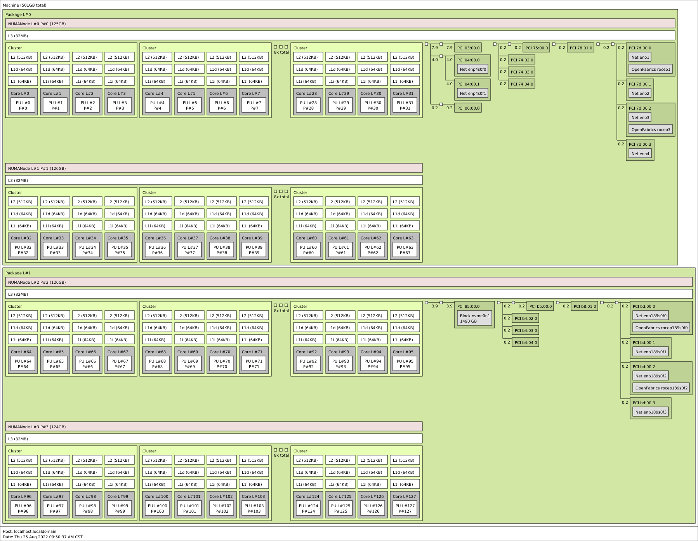

# openEuler WayCa SIG 高性能调度Wayca Scheduler

[toc]

##  介绍及范围

Wayca Scheduler希望能够基于鲲鹏服务器的硬件拓扑结构，通过优化的调度方法充分利用CPU，
cache，内存，IO外设等组件，提升系统硬件的利用率，提升内存带宽，降低内存及Cache的访
问延迟及外设访问延迟，从而使应用在鲲鹏服务器上达到较为优化的性能。

当前Wayca Scheduler仅考虑运行Linux系统的鲲鹏服务器。主要考虑在Linux内核和用户态两
个方面进行优化和支持的完善。

主线Linux内核对于鲲鹏服务器的拓扑支持待完善，相关的算法比如CFS调度算法对于鲲鹏拓扑
不感知，从而导致用户不能通过系统获取完整完善的拓扑结构，并且不能充分利用硬件的拓扑
特性从而使状态达到最优化。当前我们在持续推动内核在以下方面进行支持和完善。

- 完善Linux内核对于鲲鹏拓扑的支持和导出
- 优化Linux CFS算法实现，能够感知考虑鲲鹏的拓扑结构
- 其他部分的优化探索

同时考虑到Linux调度算法（及其他算法）面对的是普适场景，可能无法满足用户场景的多样
性和满足特定应用对资源的特定需求；对于系统资源考虑到的粒度太粗，不能考虑到详细的拓
扑层级，可能不能基于业务特点根据业务的内存，充分考虑中断，IO，外设等资源进行调度；
不能考虑到时延、带宽等对于软件部署的影响。因此，Wayca Scheduler基于鲲鹏服务器考虑
在用户态进行以下支持和探索：

- 支持用户态工具对于鲲鹏拓扑的感知和导出
- 探索用户态调度（eBPF，UMCG等）在鲲鹏上的应用

## 拓扑介绍

一台典型的2x64C鲲鹏服务器拓扑如图所示([数据源](https://github.com/open-mpi/hwloc/blob/v2.9/tests/hwloc/linux/128arm-2pa2n8cluster4co.output))。
单片处理器由2个DIE组成，每个DIE为独立的NUMA节点，共享L3 Cache；L3 Cache由L3 Tag
（标签缓存及一致性维护）和L3 Data（数据缓存）组成，共享L3Tag的CPU组成一个Cluster。

外设位于每片的第一个NUMA上。

##  内核态

### Cluster拓扑的解析和导出

ACPI协议已经支持对Cluster拓扑的描述。需要内核arch topology驱动支持对于该信息的解析
并通过sysfs文件系统导出该拓扑信息。

当前主线已经支持该[特性](https://git.kernel.org/pub/scm/linux/kernel/git/torvalds/linux.git/commit/?id=c5e22feffdd736cb02b98b0f5b375c8ebc858dd4)。Openeuler OLK-5.10已合入该
特性:

|commit id|Subject|
|---------|-------|
|c84cd40a40dc|topology: Represent clusters of CPUs within a die|

### Cluster调度域的建立及CFS负载均衡对于Cluster的支持

支持CFS调度器感知识别cluster拓扑，能够建立cluster调度域。负载均衡算法在鲲鹏服务器
上能够在cluster间对任务进行均衡。

由于Cluster内的CPU共享L3T的带宽，当任务聚集在Cluster内时可能导致任务的L3 Cache访问
带宽受限；通过对任务在Cluster间进行均衡，能够提升任务可以获取的L3带宽上限。

当前主线已经支持该[特性](https://git.kernel.org/pub/scm/linux/kernel/git/torvalds/linux.git/commit/?id=778c558f49a2cb3dc7b18a80ff515e82aa813627)。Openeuler OLK-5.10已合入该
特性:

|commit id|Subject|
|---------|-------|
|ac032ae3d889|sched: Add cluster scheduler level in core and related Kconfig for ARM64|

### CFS任务唤醒算法对于Cluster的支持

当前该[特性](https://lore.kernel.org/lkml/20220822073610.27205-1-yangyicong@huawei.com/)正在上传主线及[Openeuler](https://gitee.com/openeuler/kernel/pulls/169#note_13737220)。

### NUMA调度对于鲲鹏3-Hop拓扑的支持

完善CFS对于鲲鹏NUMA拓扑的支持，正确建立NUMA调度域及调度组。

当前主线已经支持该[特性](https://git.kernel.org/pub/scm/linux/kernel/git/torvalds/linux.git/commit/?id=585b6d2723dc927ebc4ad884c4e879e4da8bc21f)。Openeuler OLK-5.10分支已合入
该特性:

|commit id|Subject|
|---------|-------|
|0bba059c590d|sched/topology: fix the issue groups don't span domain->span for NUMA diameter > 2"|

##  用户态工具

### hwloc支持

Hwloc是Open MPI的子项目之一，主要针对HPC场景，提供一套基于C API的动态库和一组命令
行工具用于提供硬件的外设，互联及其他拓扑信息。

Hwloc原生支持大部分的鲲鹏拓扑解析。对于Cluster的拓扑[支持](https://github.com/open-mpi/hwloc/pull/495)
在2.7.0版本中合入。
