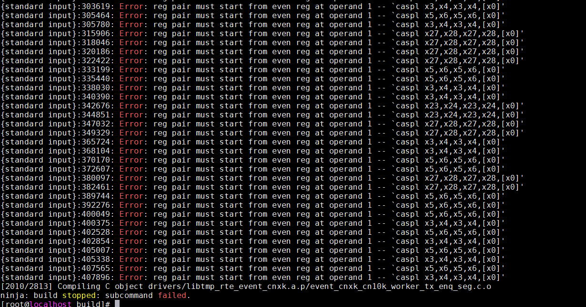
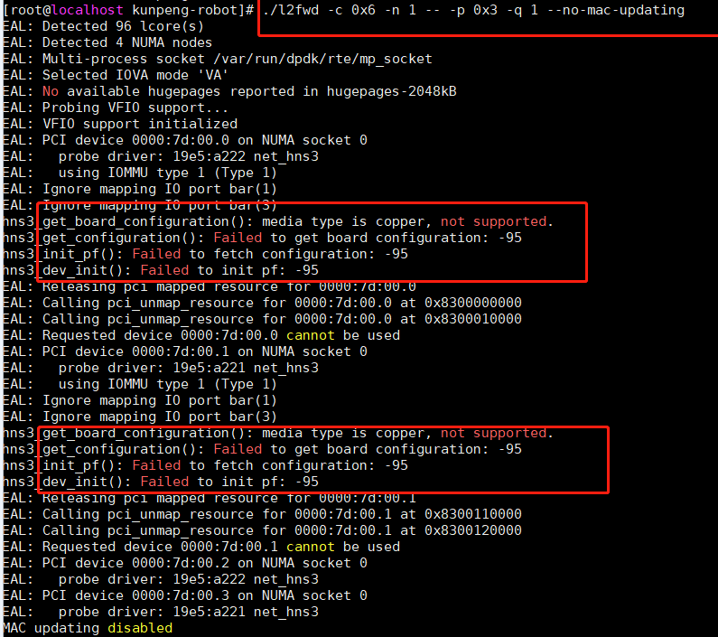

# WayCa SIG 鲲鹏板载网卡DPDK驱动使用指南

## 1. DPDK安装
### 1.1 DPDK库安装
> yum install dpdk

对于Openeuler-22.03及以上版本，可以使用以上方式进行安装。若使用Openeuler-22.03以下的版本，其中配套的DPDK版本较早，hns3驱动未回合任何bugfix且功能不完备，建议不要使用这种方式安装DPDK库。

### 1.2 源码安装
从DPDK官网(http://core.dpdk.org/download/) 下载目标版本的最新LTS版本源码。  
注意：社区维护的LTS版本会定期回合bugfix，建议产品迭代时也定期从对应稳定分支回合bugfix。

#### 1.2.1 安装依赖包
> yum install kernel-headers libpcap-devel numactl-devel

#### 1.2.3 源码编译
* 以DPDK 21.11编译为例：

> meson build && ninja -C build

若欲编译DPDK工程中的example，可在编译时增加-Dexamples参数，如“-Dexamples=l2fwd,l3fwd”。  
更详细的编译说明，请阅DPDK的官方指导：http://doc.dpdk.org/guides/linux_gsg/build_dpdk.html


## 2. 大页配置
以下以2M大页为例进行说明。
* 挂载大页：
> mkdir -p /mnt/huge  
> mount -t hugetlbfs hugetlbfs /dev/hugepages -o "pagesize=2M" 

* 给每个node分配大页：
> echo 512 > /sys/devices/system/node/nodeX/hugepages/hugepages-2048kB/nr_hugepages  
> (nodeX表示node0, node1, node2, node3)

* 或者通过以下命令给每个node均分指定的大页数：
> echo 2048 > /sys/kernel/mm/hugepages/hugepages-2048kB /nr_hugepages

* 还可以在grub文件中修改默认大页规格配置静态大页，如下设置1G大页规格：
> default_hugepagesz=1G hugepagesz=1G hugepages=80

选择配置静态大页的方式，OS启动时大页已配置好。
*  如果业务性能要求较高，建议配置静态大页。4K系统使用1G大页，64K系统使用512M大页。

## 3. 绑定设备与驱动
DPDK工程中提供了查询和绑定网卡的python脚本，基本使用方法如下：
- 查看目标网卡处于用户态还是内核态：
> ./usertools/dpdk-devbind.py –s
- 绑定网卡到用户态：
> ./usertools/dpdk-devbind.py --bind=vfio-pci ${BDF}
- 绑定网卡到内核态：
> ./usertools/dpdk-devbind.py --bind=hns3 ${BDF}

以上BDF即为网卡的pci设备号，如0000:7d:00.0。


## 4. 网卡功能测试指导
（1）加载vfio_pci相关驱动，根据开关SMMU状态，选择vfio是否需要工作在no-iommu模式。
> modprobe vfio-pci

若关SMMU模式，在以上基础上再使用如下方式配置no-iommu模式：
> echo 1 > /sys/module/vfio/parameters/enable_unsafe_noiommu_mode

关SMMU时或者使用如下命令配置no-iommu模式：
> modprobe vfio enable_unsafe_noiommu_mode=1  
modprobe vfio-pci

（2）将网卡从内核态绑定到用户态
> ./usertools/dpdk-devbind.py -b vfio-pci 0000:7d:00.0

（3）启动testpmd

```
[root@localhost dpdk-next-net]# ./build/app/dpdk-testpmd -a 0000:7d:00.0 -l 10-18 --file-prefix=rte_lee  -- -i --rxq=4 --txq=4 --rxd=2048 --txd=2048 --burst=64
EAL: Detected CPU lcores: 96
EAL: Detected NUMA nodes: 4
EAL: Detected static linkage of DPDK
EAL: Multi-process socket /var/run/dpdk/rte_lee/mp_socket
EAL: Selected IOVA mode 'VA'
EAL: VFIO support initialized
EAL: Using IOMMU type 1 (Type 1)
EAL: Ignore mapping IO port bar(1)
EAL: Ignore mapping IO port bar(3)
EAL: Probe PCI driver: net_hns3 (19e5:a222) device: 0000:7d:00.0 (socket 0)
TELEMETRY: No legacy callbacks, legacy socket not created
Interactive-mode selected
testpmd: create a new mbuf pool <mb_pool_0>: n=211456, size=2176, socket=0
testpmd: preferred mempool ops selected: ring_mp_mc
Warning! port-topology=paired and odd forward ports number, the last port will pair with itself.
Configuring Port 0 (socket 0)
0000:7d:00.0 hns3_set_fiber_port_link_speed(): auto-negotiation is not supported, use default fixed speed!
Port 0: 00:18:2D:00:00:79
Checking link statuses...
Done
testpmd> 
testpmd> 0000:7d:00.0 hns3_update_link_status(): Link status change to up!
Port 0: link state change event
testpmd>
```

（4）查询端口link状态

```
testpmd> show port summary all
Number of available ports: 1
Port MAC Address       Name         Driver         Status   Link
0    00:18:2D:00:00:79 0000:7d:00.0 net_hns3       up       10 Gbps
```

（5）设置网卡发包

```
testpmd> set fwd txonly 
Set txonly packet forwarding mode
testpmd> start 
txonly packet forwarding - ports=1 - cores=1 - streams=4 - NUMA support enabled, MP allocation mode: native
Logical Core 11 (socket 0) forwards packets on 4 streams:
  RX P=0/Q=0 (socket 0) -> TX P=0/Q=0 (socket 0) peer=02:00:00:00:00:00
  RX P=0/Q=1 (socket 0) -> TX P=0/Q=1 (socket 0) peer=02:00:00:00:00:00
  RX P=0/Q=2 (socket 0) -> TX P=0/Q=2 (socket 0) peer=02:00:00:00:00:00
  RX P=0/Q=3 (socket 0) -> TX P=0/Q=3 (socket 0) peer=02:00:00:00:00:00

  txonly packet forwarding packets/burst=64
  packet len=64 - nb packet segments=1
  nb forwarding cores=1 - nb forwarding ports=1
  port 0: RX queue number: 4 Tx queue number: 4
    Rx offloads=0x80000 Tx offloads=0x10000
    RX queue: 0
      RX desc=2048 - RX free threshold=32
      RX threshold registers: pthresh=0 hthresh=0  wthresh=0
      RX Offloads=0x80000
    TX queue: 0
      TX desc=2048 - TX free threshold=1952
      TX threshold registers: pthresh=0 hthresh=0  wthresh=0
      TX offloads=0x10000 - TX RS bit threshold=32
testpmd> show fwd stats all

  ------- Forward Stats for RX Port= 0/Queue= 0 -> TX Port= 0/Queue= 0 -------
  RX-packets: 0              TX-packets: 6984480        TX-dropped: 15122976      

  ------- Forward Stats for RX Port= 0/Queue= 1 -> TX Port= 0/Queue= 1 -------
  RX-packets: 0              TX-packets: 6953216        TX-dropped: 15154368      

  ------- Forward Stats for RX Port= 0/Queue= 2 -> TX Port= 0/Queue= 2 -------
  RX-packets: 0              TX-packets: 6974176        TX-dropped: 15133472      

  ------- Forward Stats for RX Port= 0/Queue= 3 -> TX Port= 0/Queue= 3 -------
  RX-packets: 0              TX-packets: 6999328        TX-dropped: 15108448      

  ---------------------- Forward statistics for port 0  ----------------------
  RX-packets: 0              RX-dropped: 0             RX-total: 0
  TX-packets: 27903808       TX-dropped: 60519424      TX-total: 88423232
  ----------------------------------------------------------------------------

  +++++++++++++++ Accumulated forward statistics for all ports+++++++++++++++
  RX-packets: 0              RX-dropped: 0             RX-total: 0
  TX-packets: 27903808       TX-dropped: 60519424      TX-total: 88423232
  ++++++++++++++++++++++++++++++++++++++++++++++++++++++++++++++++++++++++++++

```
## 5. 性能调优指导
### 5.1 禁用CPU动态调频
禁用动态调频确保CPU工作在最大频率，配置方法有两种。
- 系统配置文件的CPU Frequency scaling中,将如下配置配为y,则系统默认选用performance模式。
CONFIG_CPU_FREQ_DEFAULT_GOV_PERFORMANCE=y
- BIOS可禁用动态调频。不同型号的Kunpeng服务器上禁用方法可能有所不同，如kunpeng920配置路径如下：
Advanced->Performance config->Power Policy   选择Performance

### 5.2 大页配置
DPDK使用大页来提升TLB命中率，要使得DPDK网卡性能达到最佳，4K系统推荐使用1G大页； 64K系统推荐使用512M大页。
可在系统BOOT内核启动参数中增加静态大页的配置参数，如：default_hugepagesz=1G hugepagesz=1G hugepages=80或default_hugepagesz=512M hugepagesz=512M hugepages=80。

### 5.3 禁用透明大页
关掉透明大页方法如下：
echo never > /sys/kernel/mm/transparent_hugepage/enabled

### 5.4 核隔离配置
使用核隔离来避免CPU被其他进程抢占，保证DPDK进程100%占用CPU，在Linux OS启动前，在Boot启动CMDLINE中增加核隔离启动参数，如：isolcpus=1-18 nohz_full=1-18 rcu_nocbs=1-18"

### 5.5 NUMA亲和
使用和网卡相同numa的CPU，避免跨NUMA增加内存访问延迟。

### 5.7 队列深度和burst大小
队列深度增大，可以有一定的防抖作用，但队列深度设置过大也会影响性能，可以根据实际应用场景进行调整。推荐使用功能队列深度为2048和64 burst大小。

### 5.8 使用多队列
利用RSS功能，实现数据流的负载均衡。配置多队列业务模型推荐如下：
- 一个核负责一个队列
- 使用五元祖跳变确保散列均衡

### 5.9 使用Neon向量收发包
驱动会根据Rx/Tx offload配置自动适配收发包算法，如果只涉及单mbuf收发场景，建议合理配置Rx/Tx offload确保驱动匹配成向量收发包。具体请参考《WayCa-Kunpeng-高速网络-板载网卡DPDK驱动特性介绍》。

### 5.10 尽量避免使用同一个Cluster上的核
每个Cluster访问L3的带宽有上限，推荐每个CPU Cluster使用一个核。

### 5.11 虚拟机性能优化配置
确保虚拟机使用Host侧大页内存

### 5.12 调整网口的最大队列数
对于鲲鹏920 5250Z和鲲鹏920 7270Z服务器，通过BOIS控制一个IO DIE上所有网口总队列数不超过256，菜单路径如下：
Advanecd -> LOM configuration -> NIC configuration -> FLFX IOx Portx configuration -> Tqp Number

### 5.13 关闭UFS
对于鲲鹏920 5250Z和鲲鹏920 7270Z服务器，关闭uncore 频率调节（UFS），菜单路径如下：
Advanecd -> Power And Preformance Configuration -> CPU PM Control -> UFS

### 5.14 开启通道扩展
对于鲲鹏920 5250Z和鲲鹏920 7270Z服务器上的100G和200G网卡，如果不使用GRO功能建议使能通道扩展功能，菜单路径如下：
Advanecd -> LOM configuration -> NIC configuration -> rx multiple tunnel

## 6. 常用dump工具
* proc_info工具  
一般以从进程方式运行，调用框架接口进行信息查询。该app必须与主进程的程序一起编译方可使用。  
具体使用方法见官网http://doc.dpdk.org/guides/tools/proc_info.html。

* telemetry工具【强烈推荐】  
借助telemetry库，dpdk-telemetry.py脚本使用unix socket套接字与主进程进行消息交互。DPDK库中若注册telemetry命令，则可支持查询。

运行如下(rte_lee是DPDK的--file-prefix指定的名字)：

```
dpdk-telemetry.py -f rte_lee
Connecting to /var/run/dpdk/rte_lee/dpdk_telemetry.v2
{
  "version": "DPDK 21.11.0",
  "pid": 240843,
  "max_output_len": 16384
}
Connected to application: "dpdk-testpmd"
-->
```

- 输入“/”+Tab间，可查询所用DPDK库支持的所有命令：

```
--> /
/                                /eal/params
/cnxk/ethdev/info                /ethdev/dump_priv
/cnxk/mempool/info               /ethdev/info
/cnxk/nix/cq/ctx                 /ethdev/link_status
/cnxk/nix/cq/info                /ethdev/list
/cnxk/nix/info                   /ethdev/stats
/cnxk/nix/list                   /ethdev/xstats
/cnxk/nix/rq/ctx                 /eventdev/dev_list
/cnxk/nix/rq/info                /eventdev/dev_xstats
/cnxk/nix/sq/ctx                 /eventdev/port_list
/cnxk/nix/sq/info                /eventdev/port_xstats
/cnxk/npa/aura/info              /eventdev/queue_links
/cnxk/npa/aura/list              /eventdev/queue_list
/cnxk/npa/info                   /eventdev/queue_xstats
/cnxk/npa/pool/info              /eventdev/rxa_queue_conf
/cnxk/npa/pool/list              /eventdev/rxa_queue_stats
/cryptodev/caps                  /eventdev/rxa_queue_stats_reset
/cryptodev/info                  /eventdev/rxa_stats
/cryptodev/list                  /eventdev/rxa_stats_reset
/cryptodev/stats                 /help
/dmadev/dump                     /info
/dmadev/info                     /mempool/info
/dmadev/list                     /mempool/list
/dmadev/stats                    /rawdev/list
/eal/app_params                  /rawdev/xstats
/eal/heap_info                   /security/cryptodev/crypto_caps
/eal/heap_list                   /security/cryptodev/list
/eal/memzone_info                /security/cryptodev/sec_caps               

```
- 查询设备信息

```
--> /ethdev/info,0
{
  "/ethdev/info": {
    "name": "0000:7d:00.0",
    "state": 1,
    "nb_rx_queues": 1,
    "nb_tx_queues": 1,
    "port_id": 0,
    "mtu": 1500,
    "rx_mbuf_size_min": 2176,
    "rx_mbuf_alloc_fail": 0,
    "mac_addr": "18:3D:5E:8E:E3:E5",
    "promiscuous": 1,
    "scattered_rx": 0,
    "all_multicast": 0,
    "dev_started": 1,
    "lro": 0,
    "dev_configured": 1,
    "rxq_state": [
      1
    ],
    "txq_state": [
      1
    ],
    "numa_node": 0,
    "dev_flags": "0x3",
    "rx_offloads": "0x0",
    "tx_offloads": "0x10000",
    "ethdev_rss_hf": "0x0"
  }
}
--> 
```

- 查询link状态

```
--> /ethdev/link_status,0
{
  "/ethdev/link_status": {
    "status": "UP",
    "speed": 100000,
    "duplex": "full-duplex"
  }
}
```

- 查询mempool的列表和信息

```
--> /mempool/list
{
  "/mempool/list": [
    "mb_pool_0"
  ]
}
--> 
--> /mempool/info,mb_pool_0
{
  "/mempool/info": {
    "name": "mb_pool_0",
    "pool_id": 6426645760,
    "flags": 16,
    "socket_id": 0,
    "size": 187456,
    "cache_size": 250,
    "elt_size": 2304,
    "header_size": 128,
    "trailer_size": 0,
    "private_data_size": 128,
    "ops_index": 6,
    "populated_size": 187456,
    "total_cache_count": 231,
    "common_pool_count": 186201,
    "mz_name": "MP_mb_pool_0",
    "mz_len": 2130304,
    "mz_hugepage_sz": 1073741824,
    "mz_socket_id": 0,
    "mz_flags": 0
  }
}
--> 
```

## 7. 常见问题

[1] meson编译报错  
现象：编译DPDK报caspl指令错误


原因：21.11支持了128bit比较交换原子指令操作，使用casp指令。鲲鹏920支持该指令，但版本小于9的gcc是不支持__ARM_FEATURE_ATOMICS，如果gcc版本比较低，就会报以上错误。   
解决办法：  
(1)升级gcc  
(2)通过-Ddisable_drivers=*/octeontx*,*/cnxk 选项屏蔽报错驱动。  
PS: 若使用动态库编译时遇到，则可增加-march =armv8.2-a的方式编译。

[2] 网口的link状态为down  
解决办法：  
(1)电口：关自协商时，两端速率配置是否一致  
(2)光口：i) 两端自协商状态是否一致; ii)两端自协商关闭时，观察两端速率配置是否一致，FEC模式配置是否一致。

[3] 网口报”media type is copper, not supported.“
  
原因：DPDK hns3 PF驱动只有固件支持phy驱动，才支持电口设备。  
解决办法：将板载网卡上的电口插卡换成光口插卡。或者使用电口设备使能SRIOV，将VF绑定到DPDK使用。

[4] 网卡收不到报文
解决办法：  
    - 混杂是否使能，如果未使能，则查看报文目的MAC是否是网卡的地址。  
    - 排查报文是否是VLAN报文，是否使能了VLAN过滤，若VLAN过滤使能了，是否配置了该VLAN ID。  
    - 如果是VLAN报文，但应用未使能VLAN过滤，则可能是驱动默认将VLAN过滤使能了。请查看所使用的DPDK版本，如果为19.11.3以前的LTS版本，则查看是否有回合以下patch: c6f7d7594934 ("net/hns3: fix default VLAN filter configuration for PF")

[5]  stats统计中bytes和imiss统计项为0  
解决办法：驱动自21.05以后的版本开始才支持该功能，查看是否回合如下patch，建议升级DPDK：

|  Commit ID | Subject  | Tag  |OpenEuler合入状态<br><Y/N> |
| :------------: | :------------: | :------------: | :------------: |
|fdcd6a3e0246 |[net/hns3: add bytes stats](https://git.dpdk.org/next/dpdk-next-net/commit/?id=fdcd6a3e0246bb19007fbd05b6ea5fc00109392b)| DPDK-21.05 | Y |
|0f10bd6b1fb3 |[net/hns3: support imissed stats for PF/VF](https://git.dpdk.org/next/dpdk-next-net/commit/?id=0f10bd6b1fb3d1981e9d4d82bb4473c75e634980)| DPDK-21.11 | Y |
|3e9f3042d7c8 |[net/hns3: add imissed packet stats](https://git.dpdk.org/next/dpdk-next-net/commit/?id=3e9f3042d7c80f90158ff6227981913a2074aece)| DPDK-21.05 | Y |

[6] 绑网卡到用户态时报"vfio-pci: probe of 0000:06:00.0 failed with error -22"错误：  
解决办法：建议查看SMMU的开关状态，关SMMU时，必须将vfio_pci工作在noiommu模式。
