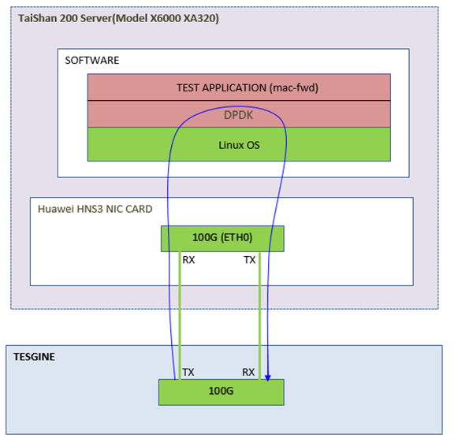
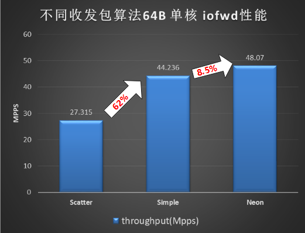

# WayCa SIG 鲲鹏板载网卡DPDK驱动介绍

## DPDK hns3驱动简介

鲲鹏920系列处理器网络控制器的驱动有两个：内核态的hns3驱动和DPDK中的hns3驱动(用户态)。网卡设备同一时刻可在两者中的任意一个驱动下正常运行。DPDK hns3驱动支持物理网卡(PF)设备，也支持内核态PF生成的SR-IOV的虚拟网卡(VF)设备。

### 源码仓路径
openeuler kernel仓：https://gitee.com/openeuler/kernel.git  
openeuler DPDK仓： https://gitee.com/src-openeuler/dpdk  
DPDK社区主线仓：http://dpdk.org/git/next/dpdk-next-net  
DPDK稳定分支仓：http://dpdk.org/git/dpdk-stable  
驱动代码目录：drivers/net/hns3

### 内核依赖
板载网卡设备需通过内核态UIO驱动将设备托管到用户态才可运行，hns3驱动支持的UIO驱动有：igb_uio和vfio_pci。

- igb_uio驱动  
该驱动不随linux主线演进，由DPDK社区自己维护，需使用源码编译ko，方可使用。  
•限制：  
(1) 仅可在关SMMU场景使用。  
(2)	仅支持一个中断，在多中断场景不可使用。

- vfio驱动  
该驱动随linux主线演进，开和关SMMU场景均支持，支持多中断场景(如中断+轮训收包模式)，因此推荐使用vfio_pci驱动。  
VFIO相关的编译选项:

```
CONFIG_VFIO=m
CONFIG_VFIO_PCI=m
CONFIG_VFIO_NOIOMMU=y
CONFIG_VFIO_VIRQFD=m
CONFIG_VFIO_IOMMU_TYPE1=m
```
注：不同的内核版本vfio相关的ko不同，请以实际的内核版本为准。

## 基础版本特性列表
* 支持多种接口形态  
•支持光口、电口和背板形态  
•支持10M/100M/1000M/10G/25G/40G/50G/100G速率  
•电口支持速率和流控自协商  
•光口和背板支持速率、FEC、PAUSE流控自协商
* 支持多种收包模式  
•轮询模式  
•中断+轮询模式
* 支持CPU卸载  
• 支持TX/RX校验和卸载  
• 支持TSO&GRO卸载  
• 支持VLAN TAG卸载  
• 支持RSS  
• 支持流表
* 支持基本配置  
• 支持配置MTU  
• 支持配置MAC地址  
• 支持混杂和全组播模式配置  
• 支持VLAN过滤和PVID  
• 支持配置队列数和修改队列深度  
• 支持rx_buf_len指定  
• 支持MAC pause流控  
• 支持FEC功能  
• 支持速率切换  
• 支持keep CRC功能  
• 支持Basic统计功能  
• 支持link状态管理(link查询/LSC功能/link up/down设置)
* 支持QOS功能  
• 支持ETS和PFC  
• 支持TM功能
* 支持故障检测和恢复处理  
• 支持RAS处理  
• 支持FLR复位恢复
* 支持多种dump功能  
• 支持xstats统计功能  
• 支持dump寄存器  
• 支持设备私有数据  
• 支持dump RxTx描述符信息  
• 支持dump光模块信息

## 重要特性  
* 支持LSE事件上报  
* 支持runtime config功能  
* 支持多种收发包函数  
* 支持多进程功能  
* 支持故障检测和恢复处理  
* 支持高精度时钟协议  
* 支持RSS规则叠加功能  
* 支持流表规则配置  

• 更详细的特性列表，以及PF和VF之间特性差异见DPDK官网  
http://doc.dpdk.org/guides/nics/overview.html

以下主要针对重要特性进行介绍。

### 特性1：支持LSE事件上报
LSE全称为link status event，表示link事件快速上报，对一些需快速感知link状态变化的业务非常有用。

用户通过rte_eth_dev_info_get()获取设备的dev_flags是否支持LSC能力。  
用法：  
(1) 业务注册事件处理函数；  
(2) 在调用rte_eth_dev_configure()时，若设备支持LSC能力，将struct rte_eth_conf::intr_conf::lsc设置为1；  
(3) 设备link状态变化时，事件处理函数就会被调用。

- 注：  
(1）PF和VF于DPDK-21.11及以后的版本支持该功能。  
(2) VF的LSE功能，依赖PF驱动支持主动推送link状态的补丁。


- 内核态依赖

|  Commit ID | Subject  | Tag  |OpenEuler合入状态<br><Y/N> |
| :------------: | :------------: | :------------: | :------------: |
| 18b6e31f8bf4 | [net: hns3: PF add support for pushing link status to VFs](https://git.kernel.org/pub/scm/linux/kernel/git/torvalds/linux.git/commit/?id=18b6e31f8bf4ac7af7b057228f38a5a530378e4e) | kernel v5.13-rc1 | Y |


- 用户态patch

| Commit ID  | Subject  | Tag  |OpenEuler合入状态<br><Y/N> |
| :------------: | :------------: | :------------: | :------------: |
| e63ae349e1a8  | [net/hns3: support LSC event report](https://git.dpdk.org/next/dpdk-next-net/commit/?id=e63ae349e1a829b221a68466955893452aa0411e)  | DPDK-v21.05 | Y |
| 3b37cbe6179a  | [net/hns3: refactor PF LSC event report](https://git.dpdk.org/next/dpdk-next-net/commit/?id=3b37cbe6179aeebc02b5e5cf3e39dfb2d5e69a01)  | DPDK-v21.05 | Y |
| 9bc2289fe5ea  | [net/hns3: refactor VF LSC event report](https://git.dpdk.org/next/dpdk-next-net/commit/?id=9bc2289fe5ea771f62412fce41c22d9ed7c31e67)  | DPDK-v21.05 | Y |
| 2192c428f9a6  |[net/hns3: fix firmware compatibility configuration](https://git.dpdk.org/next/dpdk-next-net/commit/?id=2192c428f9a6a92a8d8913fd9cf727ffa5810245)| DPDK-v21.05 | Y |


注：用户态patch列表中的commit_id为dpdk社区主线的id，下同。

### 特性2：支持runtime config功能
业务dpdk初始化进程一般会为rte_eal_init传入一些参数，其中程序加载何种设备一般是通过白名单“-a BDF”方式指定的。runtime config就是紧随设备的PCI设备号传入的那部分参数，如"-a 0000:7d:00.0,rx_func_hint=common"。这些参数可传递给该BDF对应的驱动以实现某些功能控制，驱动支持的runtime配置如下表：
| 参数名  | 参数取值  | 说明  |
| :------------: | :------------: | :------------ |
| rx_func_hint  | vec/simple/common | 供用户指定目标收包算法  |
| tx_func_hint  | vec/simple/common | 供用户指定目标发包算法  |
| mbx_time_limit_ms  | 2字节十进制数 | 修改VF的同步mbox消息的等待时间，范围(500，UINT16_MAX]。<br>VF与PF同步mbox消息，需要等待PF回复，默认等待时间为500ms。<br>若存在cpu调度原因PF可能未在500ms内回复VF的消息，从而导致VF命令发送超时而失败。此时，用户可通过增加此时间以规避问题出现。  |
| fdir_vlan_match_mode  | strict/nostrict  | strict模式时，输入报文流与流表规则基于VLAN个数严格匹配；nostrict模式时，输入报文流与流表规则进行部分匹配。  |


- 用户态patch

| Commit ID  | Subject  | Tag  |OpenEuler合入状态<br><Y/N> |
| :------------: | :------------: | :------------: | :------------: |
| a124f9e9591b  | [net/hns3: add runtime config to select IO burst function](https://git.dpdk.org/next/dpdk-next-net/commit/?id=a124f9e9591bf2b22b20e2d117775b0ff0b9f684)  |  DPDK-v21.11 | Y |
| 2fc3e696a7f1  | [net/hns3: add runtime config for mailbox limit time](https://git.dpdk.org/next/dpdk-next-net/commit/?id=2fc3e696a7f1925b20664b9de15f2430b9b68208)  | DPDK-v21.11  | Y |
| 5f107c4d7b7b  | [net/hns3: add FDIR VLAN match mode runtime config](https://git.dpdk.org/next/dpdk-next-net/commit/?id=5f107c4d7b7bfbc3fcaf98b4ca2963cc3e48fe93)  | DPDK-v23.07  | Y |

### 特性3：支持多种收发包算法
基于性能和功能的权衡考虑，驱动支持以下多种收发包算法。
| 算法名称  | 对应接口  | 特征  | 支持的版本  |
| :------------: | :------------: | :------------ | :------------: |
| Scalar<br>Scattered<br>(common)  | hns3_recv_scattered_pkts<br>hns3_xmit_pkts  |  支持报文多BD发送和接收；<br>支持CKSUM、VLAN、PTP、LRO、TSO等offlaod；<br>功能齐全更通用 | >=19.11 |
| Scalar<br>Simple | hns3_recv_pkts_simple<br>hns3_xmit_pkts_simple |仅支持单BD报文收发；<br>Tx只能工作在MBUF_FAST_FREE或者无offlaod能力模式；<br>Rx不可工作在scattered场景和不支持LRO功能;<br>可运用于PTP场景；| >=20.11  |
| Vector<br>Neon  | hns3_recv_pkts_vec<br>hns3_xmit_pkts_vec  | Neon向量指令加速解析和填充描述符；<br>仅支持单BD报文收发；<br>Tx只可工作在MBUF_FAST_FREE offload模式；<br>不可运行在PTP场景；<br>Rx不支持LRO、VLAN、PTP等功能，接收队列深度有限制;<br>Rx burst大小为1时不支持;<br>不支持上报流表的fd_id。 | >=20.11  |

- 注意：
1. 上表所述的单BD，即一个报文用一个描述符接收，只有一个mbuf。
2. Rx方向的VLAN功能包括vlan strip/filter、qinq strip。
3. 向量算法的接收队列深度需满足：大小是64的整数倍、且大于等于128；
4. 网卡支持的最小发包长度为33Byte，小于该长度的报文需软件padding到该长度驱动方可发送。Simple、Neon向量发包算法，不支持软件padding，由业务保证。
5. 驱动根据用户配置的offload能力，进行收发包算法匹配。可通过rx/tx_burst_mode接口获取当前收发包算法。

- 用户态patch

| CommitID | Subject | Tag |OpenEuler合入状态<br><Y/N> |
| :------------: | :------------: | :------------: | :------------: |
|7ef933908f| [net/hns3: add simple Tx path](https://git.dpdk.org/next/dpdk-next-net/commit/?id=7ef933908f04983ce6e8d1a930d59263b84d0485) | DPDK-20.05 |Y|
|a3d4f4d291 |[net/hns3: support NEON Rx](https://git.dpdk.org/next/dpdk-next-net/commit/?id=a3d4f4d291d79e2801397055067d903ef5e4d4aa)| DPDK-20.11 | Y |
|e31f123db0 |[net/hns3: support NEON Tx](https://git.dpdk.org/next/dpdk-next-net/commit/?id=e31f123db06b4400dbaa1298882401cebd541398)| DPDK-20.11 | Y |


### 特性4：支持多进程功能
DPDK框架支持多进程功能，主进程对主从进程间的共享内存和资源具有完全的控制权限，负责创建共享内存区并对共享内存做初始化操作。从进程依附于主进程，不会做共享内存区的初始化，不能对主从进程共享的内存做释放和重申请的操作。若从进程中有ethdev设备，从进程不能为设备做队列的建立或释放，不可对设备进行初始化和卸载。

hns3 PF和VF驱动均支持ethdev设备的主从进程方式运行，支持情况如下：  
(1)	主进程负责对网络设备的初始化，可对设备进行配置和查询；从进程仅支持查询设备配置信息。  
(2) 只支持主进程到从进程的通讯，支持的消息类型有：
|消息名	| 功能 |
| :------------: | :------------: |
|HNS3_MP_REQ_START_RXTX	| 请求使能RxTx数据通路 |
|HNS3_MP_REQ_STOP_RXTX|	请求关闭RxTx数据通路|
|HNS3_MP_REQ_START_TX| 请求使能Tx数据通路|
|HNS3_MP_REQ_STOP_TX|请求关闭Tx数据通路|

- 合入主线patch

|  Commit ID | Subject  | Tag  | OpenEuler合入状态<br><Y/N> |
| :------------: | :------------: | :------------: |:------------: |
|69f9b420d858| [net/hns3: add Tx start/stop multi-process handling](https://git.dpdk.org/next/dpdk-next-net/commit/?id=69f9b420d858ddbecb8d05c17fe77dbaf76df187)| DPDK-21.11 | Y |
|ff6dc76e40b8| [net/hns3: refactor multi-process initialization](https://git.dpdk.org/next/dpdk-next-net/commit/?id=ff6dc76e40b8d707df9c6273215d00fa46b628be)|DPDK-21.11| Y |
|443242212bae| [net/hns3: unregister MP action on close for secondary](https://git.dpdk.org/next/dpdk-next-net/commit/?id=443242212baeb67d298c54cc927553c92aa29bec)|DPDK-21.11| Y |
|841f8693536f| [net/hns3: fix multi-process action register and unregister](https://git.dpdk.org/next/dpdk-next-net/commit/?id=841f8693536f9410fd51d385e1090d35cfe59914)|DPDK-21.11| Y |
|323263717774| [net/hns3: fix secondary process reference count](https://git.dpdk.org/next/dpdk-next-net/commit/?id=323263717774df318d8a6e64ac8bfe546e03b8f6)|DPDK-21.11| Y |
|ac8962e96599| [net/hns3: fix ordering in secondary process initialization](https://git.dpdk.org/next/dpdk-next-net/commit/?id=ac8962e96599b713b3e87d22be602a2d9d951321)|DPDK-21.05| Y |
|23d4b61fee5d| [net/hns3: support multiple process](https://git.dpdk.org/next/dpdk-next-net/commit/?id=23d4b61fee5dc75ced7938169dc87a6174a093aa)|DPDK-19.11| Y |


### 特性5：支持故障检测和恢复处理
网卡硬件支持RAS错误故障上报，驱动支持RAS故障检测，并通过IMP、Global、PF/VF等复位进行功能恢复，以支持在不复位系统就能恢复模块功能，从而增强系统可靠性。  
网卡异常时，支持FLR(function level reset)复位恢复，命令如下：
> echo 1 > /sys/bus/pci/devices/0000\:7d\:00.0/reset

如果业务正在进行收发包处理，驱动会先通过替换收发包算法为dummy函数的方式来停流，再进行硬件复位流程。触发复位后，PF和VF驱动有复位相关日志打印，驱动xstats统计中有复位相关统计。

### 特性6：支持高精度时钟协议

IEEE1588 协议，又称 PTP（ precise time protocol，精确时间协议），时间同步精度可以达到亚微秒级别。  
使用方法请参考DPDK工程中examles\ptpclient的实现。

- 合入主线patch

|  Commit ID | Subject  | Tag  |OpenEuler合入状态<br><Y/N> |
| :------------: | :------------: | :------------: |:------------: |
|6170abd5c0cc|[net/hns3: fix inaccurate RTC time to read](https://git.dpdk.org/next/dpdk-next-net/commit/?id=6170abd5c0cc3d8cf4e358c4200ed7737d639d10)| DPDK-23.03 | Y |
|4ac14c1d961b|[net/hns3: fix Rx with PTP](https://git.dpdk.org/next/dpdk-next-net/commit/?id=4ac14c1d961b27212f7af1c6441fa8f7ec594db9)| DPDK-22.11 | Y |
|3ca3dcd65101 | [net/hns3: fix vector Rx/Tx when PTP enabled](https://git.dpdk.org/next/dpdk-next-net/commit/?id=3ca3dcd6510127162aaef359cf5b28684693da07)| DPDK-22.03 | Y |
|38b539d96eb6 |[net/hns3: support IEEE 1588 PTP](https://git.dpdk.org/next/dpdk-next-net/commit/?id=38b539d96eb60cd8bb50e4b4f7bb8f5d4c01212c)| DPDK-21.05 | Y |


### 特性7：支持RSS规则叠加功能
驱动rte_flow接口支持配置的RSS action有：types(元组)、func(算法)、key和queue(重定向表)。RSS action配置接口如下：

```
struct rte_flow_action_rss {
	enum rte_eth_hash_function func; /**< RSS hash function to apply. */
	uint32_t level;
	uint64_t types; /**< Specific RSS hash types (see RTE_ETH_RSS_*). */
	uint32_t key_len; /**< Hash key length in bytes. */
	uint32_t queue_num; /**< Number of entries in @p queue. */
	const uint8_t *key; /**< Hash key. */
	const uint16_t *queue; /**< Queue indices to use. */
};
```
hash算法、KEY和重定向表，在硬件中一个function只有一个硬件寄存器开关或者一个表项，属于全局配置。元组使能的配置，硬件每个function可基于报文类型来使能对应的元组域，属于非全局配置。  
DPDK-20.11.8及以后的版本支持RSS规则叠加功能(若使用版本中没有此功能，请查看是否回合了此关键patch: e3069658da9f ("[net/hns3: reimplement hash flow function](https://git.dpdk.org/next/dpdk-next-net/commit/?id=e3069658da9ffb6f83a0d972ff2776c405eb6a8f)"))。

* 配置策略如下：
1. rte flow接口配置RSS功能的优先级高于ethdev ops接口。
2. 驱动支持带pattern和不带pattern属性+RSS action的规则。  
  (a) 不带pattern属性创建规则时，表示RSS规则中的action是作用于所有流类型。  
  (b) 带pattern属性创建规则，一般表示该规则只对pattern属性指定的流类型生效。
3. 带pattern属性配置规则时，若RSS types为0，则与pattern指定流类型匹配的所有类型的报文的RSS hash均会被disable；若types大于0，则types需按照如下要求配置：  
  (a) types中必须包含与pattern指定的流类型关联的RSS types，且只允许指定一种。如pattern指定eth/ipv4，types只可指定为ipv4、ipv4-other或ipv4-frag。  
  (b) types还可指定L3或L4的SRC/DST_ONLY，但同一层的SRC和DST不可同时下发。若types中不设置任何SRC/DST_ONLY，则会使能该报文类型支持的所有元组。
4. 不带pattern属性配置RSS types，其配置效果等价于ethdev ops接口配置元组，会作用于所有流类型。
5. 后面的规则与前面的规则有配置项重叠时，新规则的配置项会覆盖旧规则的重叠配置项；若后面的规则被销毁后，前面的规则重叠配置项会被激活。
6. destroy一条规则，若驱动中还有其他规则，会还原被该条规则覆盖的旧规则中的配置项。若无任何规则，则RSS配置会还原到ethdev ops接口的配置状态或者默认RSS配置状态。
7. flush所有规则，RSS配置会还原到ethdev ops接口的配置状态或者默认RSS配置状态。

- 注意：
1. RSS ethdev ops接口和rte_flow接口不支持交叉混合使用。
2. 带pattern属性创建RSS规则时，该规则一般只对pattern指定的流类型生效。但hns3驱动的重定向表、算法和hash key为全局配置，对其他流类型同样生效。因此不建议用户带有pattern属性配置重定向表、算法和hash key。


### 特性8：支持流表规则配置
- 通过配置一些过滤规则，对接收的报文进行匹配，根据命中结果对报文进行丢弃或转发处理；提供的计数功能可支持规则的命中计数。仅hns3 PF驱动支持该功能。
- 接收路径上流表优先级高于RSS，接收报文时先按照流表规则进行匹配，若不命中再走RSS处理流程。

- 支持ether、vlan、tcp/udp/sctp(ipv4和ipv6)、隧道报文(vxlan/nvgre/geneve)的规则匹配；驱动支持根据以下表中的报文字段进行规则匹配：

|  报文字段 | 字段宽度(bits)  | 说明  |
| :------------: | :------------: | :------------: |
|ot_eth_type	|16|外层报文Ether type|
|ot_ip_proto	|8|外层报文Protocol field for IPv4 packet and Next header field for IPv6 packet|
|ot_sp	|16	|外层报文UDP source port|
|ot_dp	|16	|外层报文UDP destination port|
|ot_tun_vni	|24	|外层报文VxLAN/GENEVE Network identifier or NVGRE Virtual Subnet ID|
|ot_tun_flow_id	|8	|外层报文NVGRE Flow ID|
|in_dmac|48	|内层报文DMAC |
|in_smac|48|内层报文SMAC |
|in_vlan_tag_fst|16	|内层报文Tag1|
|in_vlan_tag_sec|16	|内层报文Tag2|
|in_eth_type|16	|内层报文Ether type|
|in_ip_tos|8|内层报文Type of servers|
|in_ip_proto|8|内层报文Protocol field for IPv4 packet and Next header field for IPv6 packet|
|in_sip	|128|内层报文IPv4 or IPv6 source address|
|in_dip	|128|内层报文IPv4 or IPv6 destination address|
|in_sp	|16	|内层报文TCP/UDP/SCTP source port|
|in_dp	|16	|内层报文TCP/UDP/SCTP destination port|
|in_l4_rsv	|32|	内层报文SCTP tag information|


- 支持的action类型如下表：

|  报文字段 | 字段宽度(bits)  |
| :------------: | :------------: |
|RTE_FLOW_ACTION_TYPE_QUEUE	   |指定报文到给定的队列|
|RTE_FLOW_ACTION_TYPE_DROP	   |指定报文丢弃|
|RTE_FLOW_ACTION_TYPE_RSS	   |指定报文到几个队列中(流表+RSS)|
|RTE_FLOW_ACTION_TYPE_MARK	   |指定报文的Rx mbuf中带有指定的fd_id|
|RTE_FLOW_ACTION_TYPE_FLAG	   |指定报文的Rx mbuf中带有fd_id|
|RTE_FLOW_ACTION_TYPE_COUNT	   |指定的规则需要硬件计数(支持多个规则共用一个计数寄存器，结合indirect action使用)|
|RTE_FLOW_ACTION_TYPE_INDIRECT |指定报文流的action为indirect action(需要先创建indiret action)|

- 合入主线patch

|  Commit ID | Subject  | Tag  |OpenEuler合入状态<br><Y/N> |
| :------------: | :------------: | :------------: |:------------: |
| f8e7fcbfd0 | [net/hns3: support flow action of queue region](https://git.dpdk.org/next/dpdk-next-net/commit/?id=f8e7fcbfd0b8d883343d11a5e621350362ad77ac) | DPDK-20.11 | Y |
|fcba820d9b9e| [net/hns3: support flow director](https://git.dpdk.org/next/dpdk-next-net/commit/?id=fcba820d9b9e34007223590d4c75417ed42563c1) | DPDK-19.11 | Y |

## 性能
### 测试组网：




### 环境配套
|名称|	描述|
| :------------: | :------------ |
|服务器	|XA320 V2 Kunpeng 920|
|BIOS版本	|1.09 (U76)|
|OS版本	|openEuler release 22.03 (LTS-Next) |
|kernel版本	|5.10.0-142.0.0.71.oe2203.aarch64|
|DPDK版本	|dpdk-22.11.2|
|GCC版本	|gcc version 10.3.1 (GCC)|
|meson版本	|0.59.4|
|编译命令	|meson build && ninja -C build|
|CPU	|主频2600 MHz，96 cores/96 threads|
|内存	|16 * 32768 MB，主频 2933 MHz|
|网卡	|华为HNS3 1*100G板载网卡 1块 |
|驱动	|HNS3 DPDK PMD (based on vfio-pci)|
|BIOS设置	|开SMMU<br>Advanced->MISC Config->Support Smmu->Enabled<br>关闭CPU动态调频<br>Advanced->Performance Config->Power Policy->Performance|
|grub cmdline |default_hugepagesz=1G hugepagesz=1G hugepages=80 isolcpus=1-18 nohz_full=1-18 rcu_nocbs=1-18 iommu.strict=0|

- 用例1：HNS3网卡1*100G 不同收发包算法的单核转发能力  
启动命令：
> ./build/app/dpdk-testpmd -l 1,3 -n 4 -a 0000:7d:00.0,rx_func_hint=common,tx_func_hint=common --file-prefix=lee -- -i --rxq=1 --txq=1 --txd=2048 --rxd=2048 --burst=64 --nb-cores=1 --forward-mode=io -a  
./build/app/dpdk-testpmd -l 1,3 -n 4 -a 0000:7d:00.0,rx_func_hint=simple,tx_func_hint=simple --file-prefix=lee -- -i --rxq=1 --txq=1 --txd=2048 --rxd=2048 --burst=64 --nb-cores=1 --forward-mode=io -a  
./build/app/dpdk-testpmd -l 1,3 -n 4 -a 0000:7d:00.0,rx_func_hint=vec,tx_func_hint=vec --file-prefix=lee -- -i --rxq=1 --txq=1 --txd=2048 --rxd=2048 --burst=64 --nb-cores=1 --forward-mode=io -a

发包仪以100%速率发包，统计Rx吞吐量。不同收发包算法单核iofwd测试如下：


- 用例2：HNS3网卡1*100G 4队列macfwd零丢包性能测试  
启动命令：
> ./build/app/dpdk-testpmd -l 1,3,5,7,9 -n 4 -a 0000:7d:00.0,rx_func_hint=vec,tx_func_hint=vec --file-prefix=lee -- -i --rxq=4 --txq=4 --txd=2048 --rxd=2048 --burst=64 --nb-cores=4 --forward-mode=mac -a

|Frame Size<br>(Bytes)|Line Rate<br>`[1*100G]`(Mpps)|Throughput<br>(Mpps)|Line Rate<br>(%)|
| :------------: | :------------: | :------------: | :------------: |
|64|148.809|98.0|65.86|
|128|84.459|84.451|99.99|
|256|45.289|45.285|99.99|
|512|23.496|23.494|99.99|
|1024|11.973|11.973|100|
|1518|8.127|8.127|100|
